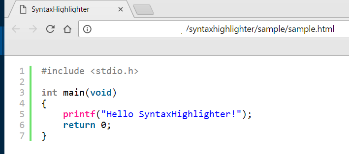

# SyntaxHighlighter v4

# 概要
これは、Alex GorbatchevさんのSyntaxHighlighter（https://github.com/syntaxhighlighter/syntaxhighlighter）を
buildしたものです。

SyntaxHighlighterは、様々なプログラミング言語のソースコードを、
HTMLソースコードに埋め込むことで、
ブラウザで表示した際にハイライトしてくれます。

defaultテーマのスクリーンショット


# 使い方
（ここで説明して作ったファイルはsampleフォルダにあります。）

0. 以下のソースコードをハイライト付きでWebブラウザに表示するとする。
```cpp
#include <stdio.h>

int main(void)
{
	printf("Hello SyntaxHighlighter!");
	return 0;
}
```

1. このリポジトリをクローンする。
```bash
git clone https://github.com/hhyuga201515/SyntaxHighlighter
```
2. 好きなテーマのフォルダを開く。
4. index.htmlをエディタで開き、不要な部分（17行目の「\<h1>SyntaxHighlighter v4.0.1\</h1>」以下）を削除する。
5. 以下のコードを追記する。
```html
	<script type="text/syntaxhighlighter" class="brush: cpp">
<![CDATA[
#include <stdio.h>

int main(void)
{
	printf("Hello SyntaxHighlighter!");
	return 0;
}
]]>
	</script>
```
6. index.htmlをWebブラウザで開く。  


# ハイライト対応言語について
以下の言語に対応しています。
言語の指定は、brushの後に記述します。
```html
<script type="text/syntaxhighlighter" class="brush: [ココ！]">
```
- AppleScript
- AS3
- Bash
- ColdFusion
- C++
- CSharp
- CSS
- Delphi
- Diff
- Erlang
- Groovy
- Haxe
- Java
- JavaFX
- JavaScript
- Perl
- Php
- Plain
- PowerShell
- Python
- Ruby
- SASS
- Scala
- Sql
- Swift
- Tap
- TypeScript
- VB
- XML

# テーマについて
リポジトリ内のディレクトリは、テーマごとに分けてあります。
それぞれのテーマのスクリーンショットを載せておくので、お好みのテーマを使ってください。

## default

## django

## eclipse

## emacs

## fadetogray

## mdultra

## midnight

## rdark

## swift


# その他便利機能
SyntaxHighlighterの便利機能をいくつか紹介します。
これらはすべて、以下のように記述すれば設定できます。
例：特定の行の強調（詳細は後述）
```html
...

<script type="text/syntaxhighlighter" class="brush: cpp, highlight: [1, 3, 5]">

...
```

## 特定の行を強調する
```html
highlight: [1, 3, 5]
```
と書くと、1, 3, 5行目を強調してくれます。


## URLのハイパーリンク解除
```html
auto-links: false
```
と書くと、URLにハイパーリンクが設定されなくなります（デフォルトではハイパーリンクが設定される）。  
ハイパーリンク解除前  


ハイパーリンク解除後  


## 行番号を途中から開始する
```html
first-line: 5
```
と書くと、行番号が5番目から始まります。


## 行番号を表示しない
```html
gutter: false
```
と書くと、行番号が表示されなくなります。

